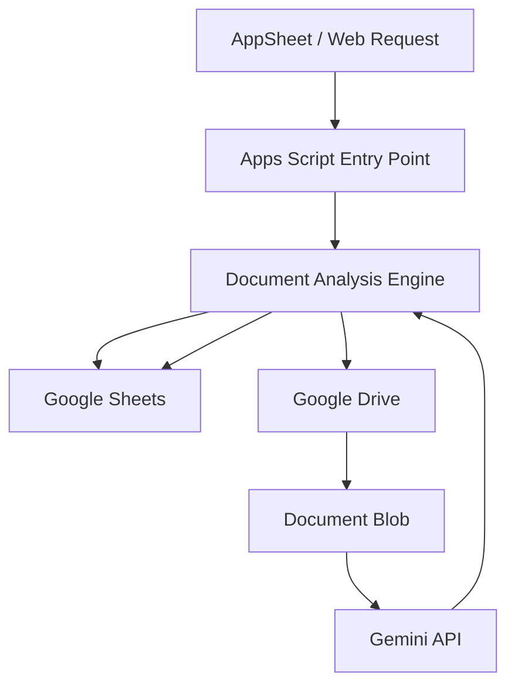

# Credentialing Automation

A document-credentialing workflow automation project built with **Google Apps Script, Google Sheets, Google Drive, AppSheet and Gemini**.

The system is designed around a common operational problem: credentialing workflows often depend on repeated document collection, validation, status updates and manual follow-up. This project turns those steps into a structured, traceable workflow.

## What it does

- Receives a credential/document analysis request from AppSheet or a web endpoint.
- Locates the corresponding file in Google Drive.
- Sends the document to Gemini for a rule-based visual/content check.
- Normalizes the model response to an explicit `APPROVED`, `REJECTED` or error state.
- Writes the result, timestamp, document type and reason back to Google Sheets.
- Retries transient Gemini API failures such as HTTP 429, 500 and 503.
- Supports permanent and temporary credentialing flows through shared analysis logic and configuration.

## Architecture



## Engineering highlights

### Shared workflow engine

Permanent and temporary credentialing flows use the same core analysis engine. Differences such as sheet names, column mappings and storage configuration are externalized instead of duplicating the full implementation.

### Configuration outside source code

Google resource IDs and API keys are loaded from Apps Script **Script Properties**. This keeps environment-specific configuration separate from the codebase and prevents secrets from being committed to Git.

### Resilience

The Gemini integration includes retry handling for transient service and quota responses. Failures are surfaced to the workflow instead of silently disappearing.

### Deterministic document mapping

Document names are normalized before matching, allowing variations in capitalization, accents and separators to resolve to the same document type.

## Repository structure

```text
credentialing-automation/
├── apps-script/
│   ├── config.gs
│   ├── document-analysis.gs
│   └── web-app.gs
├── data/
│   └── sample_credentialing_records.csv
├── docs/
│   ├── architecture.md
│   └── test-cases.md
├── .gitignore
└── README.md
```

## Sample data

`data/sample_credentialing_records.csv` contains synthetic records for demonstration and testing. No production or employee data is included.

## Configuration

The code expects the following Apps Script Script Properties in a private/demo execution environment:

```text
DEMO_SPREADSHEET_ID_PERMANENT
DEMO_SPREADSHEET_ID_TEMPORARY
DEMO_IMAGES_FOLDER_ID
DEMO_FILES_FOLDER_ID
GEMINI_API_KEY
```

These values should be configured locally in the Apps Script project settings and **must not be committed to the repository**.

## Example workflow

```text
1. A record is created or updated in AppSheet
2. The workflow identifies the document to analyze
3. Apps Script finds the uploaded file in Google Drive
4. The document is sent to Gemini
5. Gemini returns an approval/rejection response
6. Apps Script validates the response
7. Google Sheets is updated with result + timestamp + reason
8. The activity card reflects the latest document status
```

## Error handling

The workflow distinguishes between:

- missing inputs
- missing files
- unknown document types
- malformed model responses
- Gemini quota errors (HTTP 429)
- temporary Gemini availability errors (HTTP 500/503)
- unexpected API responses

## Security considerations

The public repository contains only generic/demo identifiers and synthetic data. Production resource IDs, credentials, employee information and private documents should remain outside the repository.

## Scope and limitations

This repository demonstrates the engineering pattern and workflow logic. A production deployment still requires environment-specific Google Workspace configuration, access controls, AppSheet configuration, Drive permissions and a controlled test dataset.

## Future improvements

- Persist audit events in a dedicated database.
- Add structured JSON logging and monitoring.
- Introduce automated unit/integration tests around the analysis engine.
- Add role-based access control and deployment environments.
- Add a dashboard for throughput, rejection reasons and processing latency.
